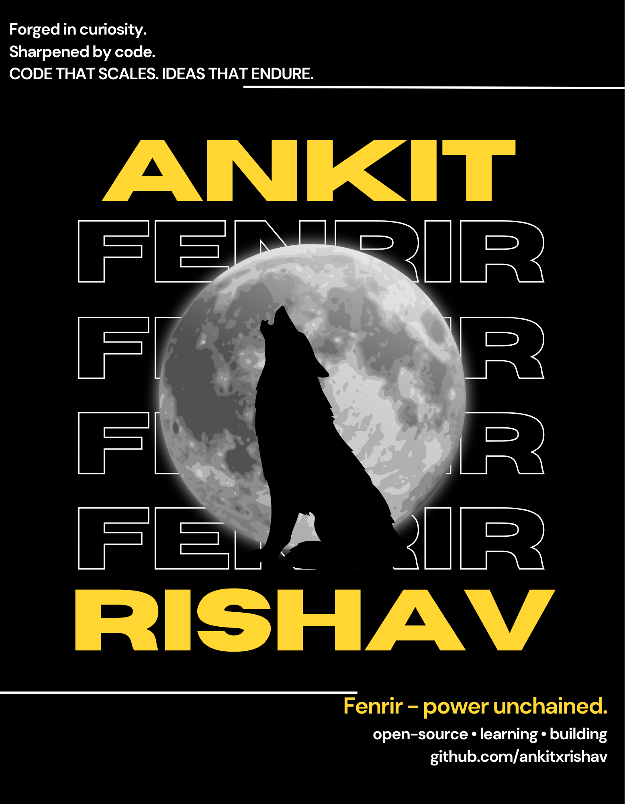

### Hey, I’m Ankit! 👋

I’m an AIML undergraduate who enjoys building systems where **code meets real-world constraints**.

I focus on real problems and try to solve them in simple, practical ways using whatever tools make sense. If something works, it works , **the tool matters less than the outcome.**.

I like projects that go beyond models — ones that involve design, architecture, and iteration.

Most of my work is experimental in nature: I try ideas, break things, and rebuild them until they feel right.

### Selected work
[Gesture-Controlled Music Generator](https://github.com/ankitxrishav/HandGesture_Music) ·
[FenrirPDF](https://github.com/ankitxrishav/FenrirPDF) ·
[FenrirStudy](https://github.com/ankitxrishav/FenrirStudy) ·
[My_portfolio](https://github.com/ankitxrishav/Portfolio_v2)

- Portfolio → https://ankitxr.vercel.app  
- LinkedIn → https://www.linkedin.com/in/ankitkx

Building things deliberately — curiosity first, perfection later.
